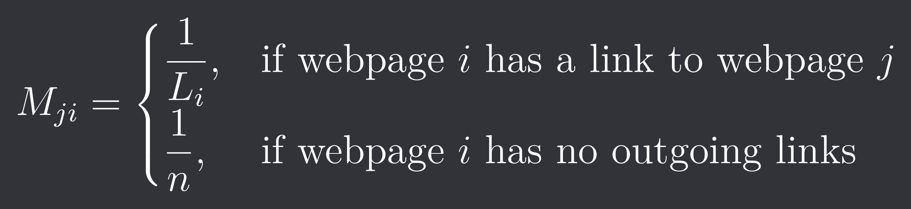
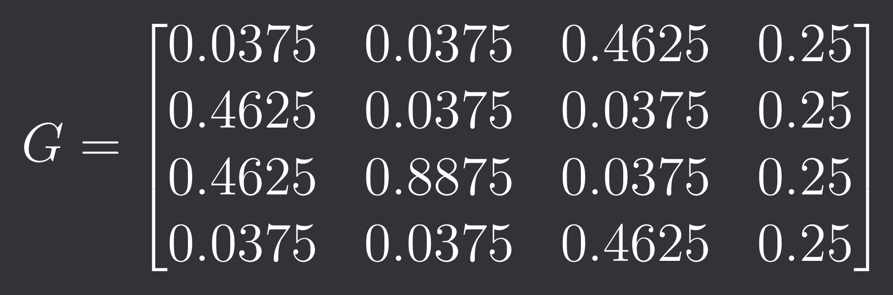
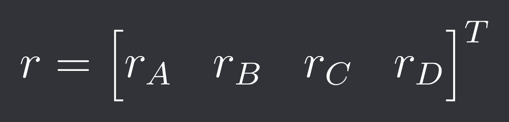
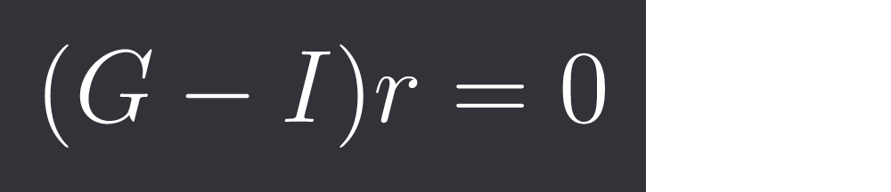
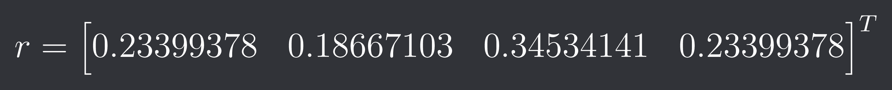

# Matrix Eigenvalues and Google's PageRank Algorithm
During 1990-1997, earlier search engines failed because they simply counted the number of keywords which made results easy to manipulate. Google revolutionized searching by introducing the PageRank Algorithm, a mathematical formula developed by Larry Page and Sergey Brin that ranks the importance of webpages by treating hyperlinks as votes of confidence. Instead of analyzing text alone, it evaluates the entire structural network of the web, giving more weight to links coming from highly trusted, authoritative websites.

This project implements the **PageRank algorithm** using concepts from **matrix algebra, eigenvalues, and eigenvectors**.
The main objective is to represent webpages as a directed graph, convert the graph into matrices, and use matrix algebra to calculate the importance of each webpage.

## Let's take an example

We represent the above connection of graph as a matrix \(A\), which is defined as:

For the above graph, the matrix is:

Here, each row represents the source webpage and each column represents the destination webpage.

## Counting Outgoing Connections
Before constructing the transition matrix, we need to find the total number of outgoing connections from each webpage.
This can be calculated by adding the elements of each row of the a matrix \(A\).

This tells us that A and C have 2 outgoing connections, B has 1 and D has 0 outgoing connection.

## Transition Matrix
The number of outgoing connections tells us how the probability is distributed when a user follows links from a webpage. This is represented by 
a Transition Matrix \(M\), which is defined as: 

where:

- $L_i$ = number of outgoing links from webpage $i$
- $n$ = total number of webpages

The transition matrix for our example graph is:

Here, each column represents the source webpage and each row represents the destination webpage.

## Google Matrix
The transition matrix assumes that the user always follows one of the available links. However, in the PageRank algorithm, a user can also randomly jump to any webpage.

To model this, we introduce a **damping factor** \(d\) = 0.85.

This means that:

- 85% of the time the user follows a link.
- 15% of the time the user randomly jumps to another webpage.

The Google Matrix is defined as : 

where:

- \(G\) = Google matrix
- \(M\) = transition matrix
- \(d\) = damping factor
- \(n\) = number of webpages
- \(J\) = matrix containing only ones

For our example : 

## Finding the PageRank Vector

The Google matrix represents the probabilities of moving between webpages. We now want to find a vector \(r\) that represents the PageRank of each webpage:

To find the PageRank values, we look for a vector \(r\) that remains unchanged after applying the Google matrix:

Here, \(Gr\) represents the **new PageRank vector** obtained after applying the transition probabilities in the Google matrix to the current PageRank vector \(r\).

The equation \(Gr=r\) means that the new PageRank values are exactly the same as the original values. Therefore, the PageRank distribution has reached a **stable state**.

Comparing this with the general eigenvalue equation:

we can see that the PageRank vector \(r\) is an **eigenvector of the Google matrix \(G\)** corresponding to the eigenvalue 1.

## Finding the Eigenvector

We need to find the eigenvector corresponding to the eigenvalue, this can be done by solving the equation:

In this project, we find the eigenvector using **Gaussian elimination and back substitution**.
The resulting eigenvector gives the **relative PageRank values** of the webpages.
After finding the eigenvector, we normalize it so that all PageRank values add up to 1.

## Normalizing the PageRank Vector

The eigenvector gives us the **relative importance** of each webpage. To obtain the final PageRank values, we normalize the eigenvector so that all values add up to 1.

We find the sum of all elements in the vector and then divide each element by that sum to get the normalized vector and the final PageRank values.

## Conclusion

We get the final PageRank vector as:

A higher PageRank value means that the webpage has a higher probability of being visited by a user following the probabilities represented by the Google matrix.

In our example, webpage C has the highest PageRank value. Therefore, based on this PageRank calculation, **C would have the highest ranking among the four webpages**.

Webpages A and D have equal PageRank values, while B has the lowest PageRank value.

Thus, the PageRank algorithm shows how the structure of links between webpages can be represented using matrices and used to determine their relative ranking.
